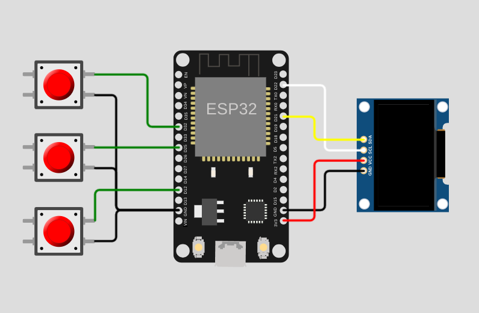

<!--
SPDX-FileCopyrightText: 2024 AFCMS <afcm.contact@gmail.com>
SPDX-License-Identifier: GPL-3.0-or-later
-->

# DevPet Meta

[devpet-repo-meta]: https://github.com/AFCMS/devpet_meta
[devpet-repo-core]: https://github.com/AFCMS/devpet
[devpet-repo-backend]: https://github.com/AFCMS/devpet_backend

A developer pet project, a small ESP32 based device with an OLED display buttons. It connects to your computer via Bluetooth where you need to run the backend which communicates with the device via serial.

To keep your virtual pet alive and happy, you need to be active on GitHub by creating issues, pull requests, and commits. The more active you are, the healthier your pet will be. You also need to make the pet happy by listening to music on Spotify or playing the integrated minigame. Oh and don't forget to feed it with coffee regularly! ☕

To get started, you need to flash the ESP32 using the instructions from the [DevPet repository][devpet-repo-core] if your ESP32 isn't yet flashed. Then you can pair the Bluetooth device "DevPet" from your computer. You then need to setup the tokens for API fetching for both GitHub and Spotify and run the backend using the instructions from the [DevPet Backend repository][devpet-repo-backend].

This project have been build as a part of my studies at [Hexagone School](https://www.ecole-hexagone.com)

## Repositories

| Repository                            | Description                                    |
| ------------------------------------- | ---------------------------------------------- |
| [DevPet Meta][devpet-repo-meta]       | Instructions, 3D models, schemas, explanations |
| [DevPet][devpet-repo-core]            | ESP32 code                                     |
| [DevPet Backend][devpet-repo-backend] | NodeJS serial backend code                     |

## Hardware

### Components

| Name      | Description                          | Link                                                                  |
| --------- | ------------------------------------ | --------------------------------------------------------------------- |
| ESP32     | Microcontroler                       |                                                                       |
| SSD1306   | OLED 128x64 monochrome 0.96" display | [Az-Delivery](https://www.az-delivery.de/fr/products/0-96zolldisplay) |
| Button x3 | 12x12x7.3mm push buttons             | [Amazon FR](https://amzn.eu/d/iSc4HgD)                                |

### 3D Printed Parts

| Description                                                   |
| ------------------------------------------------------------- |
| [STL Files](./hardware/3d)                                    |
| [3MF File (from Bambu Studio)](./hardware/3d/devpet_case.3mf) |
| [Fusion360 Archive](./hardware/3d/devpet_case_v15.f3z)        |
| [Fusion360 Cloud Project](https://a360.co/4bYumfe)            |

The final project have been printed on a [Bambu Lab X1E](https://bambulab.com/en/x1e) using an ABS filament and a 0.4mm nozzle.

### Schematics

[Wokwi Diagram](./hardware/wokwi-diagram.json)

### Paper Box

A paper box have been built to contain the DevPet.

You can find the ODG file [here](./hardware/devpet_box.odg)

## Built with

-   [GitHub](https://github.com) (source code hosting, CI, project management :heart:)
-   [PlatformIO](https://platformio.org) (embed development toolkit)
-   [image2cpp](https://javl.github.io/image2cpp) (bitmap to C++ array converter)
-   [Octicons](https://primer.style/foundations/icons) (many GitHub icons source)
-   [ASCII Draw](https://github.com/Nokse22/ascii-draw) (backend startup logo)
-   [Marp](https://marp.app) (Markdown presentations)
-   [Fusion 360](https://www.autodesk.com/products/fusion-360) (modeling of 3D printed parts)
-   [GIMP](https://www.gimp.org) (many textures)
-   [LibreSprite](https://libresprite.github.io) (the dinosaur sprites)
-   [LibreOffice Draw](https://www.libreoffice.org/discover/draw) (paper box design)

## Thanks to

-   [@Eladji](https://github.com/eladji) for providing me the Fusion360 models for the base components
-   [@AKArien0](https://github.com/AKArien0) for the [inspiration](https://github.com/AKArien0/arduino-input-handler) for the embed input handler
-   My friend [@Klhmt](https://github.com/Klhmt) for the main dinosaur sprites and animations
